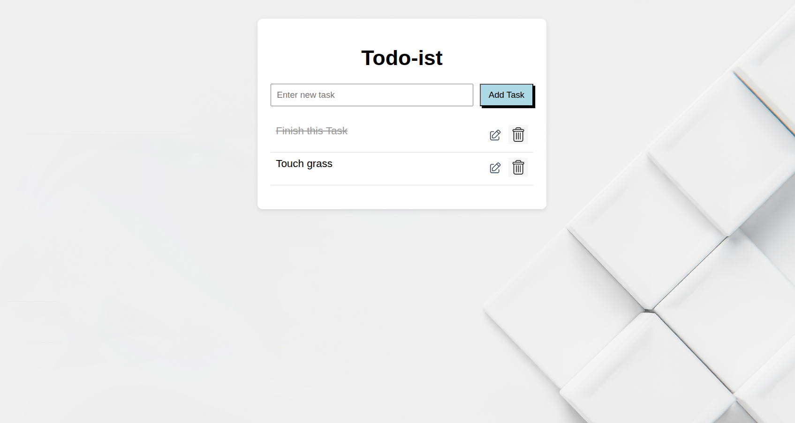

# Simple Todo List App

A Todo List web app built with HTML, CSS, and Typescript.

## Features

- Add new tasks
- Edit existing tasks
- Delete tasks

## How to Run

1. Clone or download the repository.
2. Use the typescript compiler to compile to js
3. Open `index.html` in your web browser.

## Screenshots

### Main Page

By Nathanael
