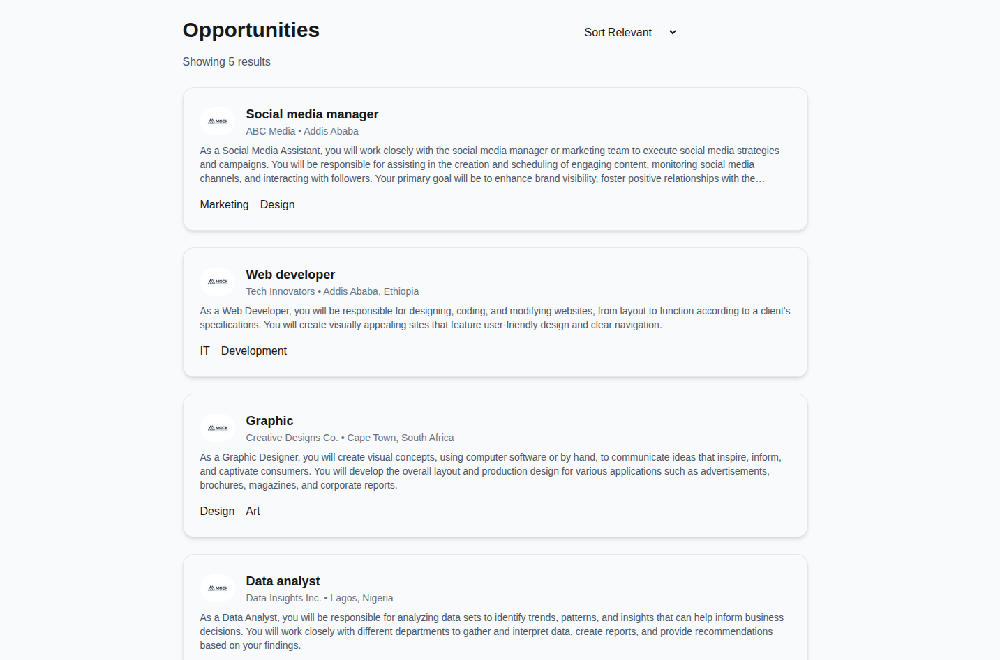
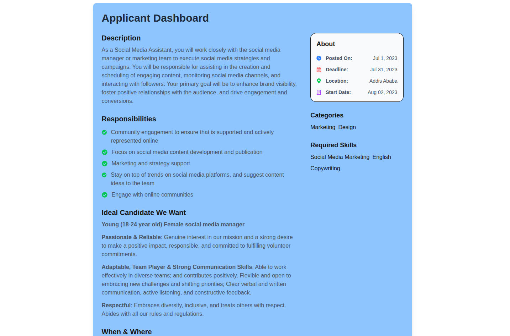

# Job Listing Platform

A modern, full-stack job listing platform built with Next.js and TypeScript.

## Features

- Browse a list of job postings
- View detailed job descriptions, requirements, and company information
- Dynamic routing for job detail pages using job titles as URL slugs
- Responsive and accessible design
- Built with Next.js App Router and TypeScript
- Uses React Icons for a visually appealing interface

## Project Structure

```
task-6_job-listing/
├── app/
│   ├── data.ts                # Job data source
│   ├── globals.css            # Global styles
│   ├── layout.tsx             # Root layout
│   ├── page.tsx               # Main job listing page
│   └── jobs/
│       └── [jobTitle]/
│           └── page.tsx       # Dynamic job detail page
├── public/                    # Static assets (images, etc.)
├── types/
│   └── job.ts                 # TypeScript types for jobs
├── next.config.ts             # Next.js configuration
├── tsconfig.json              # TypeScript configuration
├── postcss.config.mjs         # PostCSS configuration
└── README.md                  # Project documentation
```

## Getting Started

### Prerequisites

- Node.js (v18 or higher recommended)
- pnpm (or npm/yarn)

### Installation

1. Clone the repository:
   ```bash git clone https://github.com/nathanaelcheramlak/A2SV-Projects
   cd A2SV-Projects/task-6_job-listing
   ```
2. Install dependencies:
   ```bash
   pnpm install
   # or
   npm install
   # or
   yarn install
   ```
3. Run the development server:
   ```bash
   pnpm dev
   # or
   npm run dev
   # or
   yarn dev
   ```
4. Open [http://localhost:3000](http://localhost:3000) in your browser to view the app.

## Usage

- Browse available jobs on the homepage.
- Click on a job to view its details, requirements, and categories.
- Use the browser's back button or navigation to return to the job list.

## Customization

- To add or edit jobs, modify `app/data.ts`.
- To change job types or requirements, update `types/job.ts` and the data file accordingly.

## Technologies Used

- [Next.js](https://nextjs.org/)
- [TypeScript](https://www.typescriptlang.org/)
- [React](https://react.dev/)
- [Tailwind CSS](https://tailwindcss.com/) (if used)
- [React Icons](https://react-icons.github.io/react-icons/)

## Screenshots




## Author

Nathanael @ 2025
