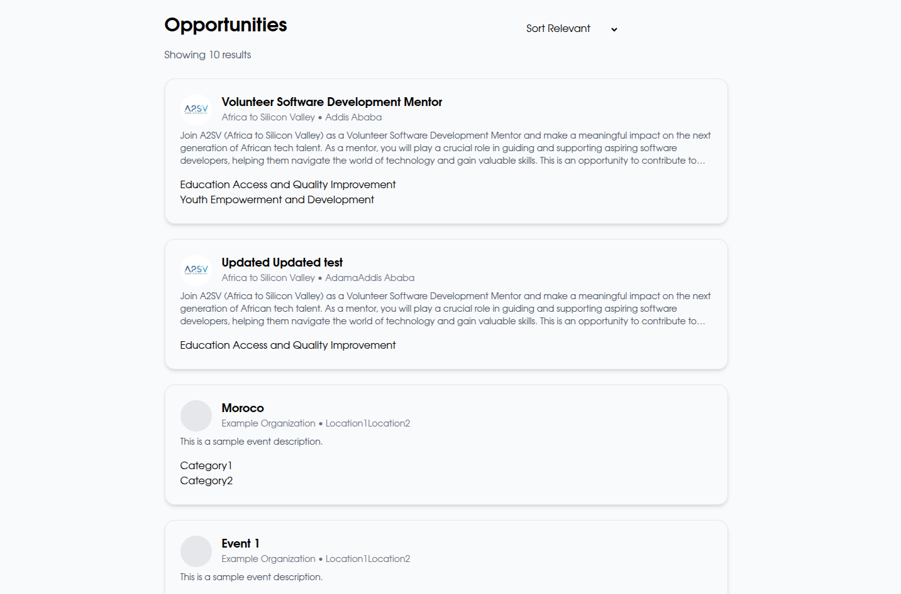
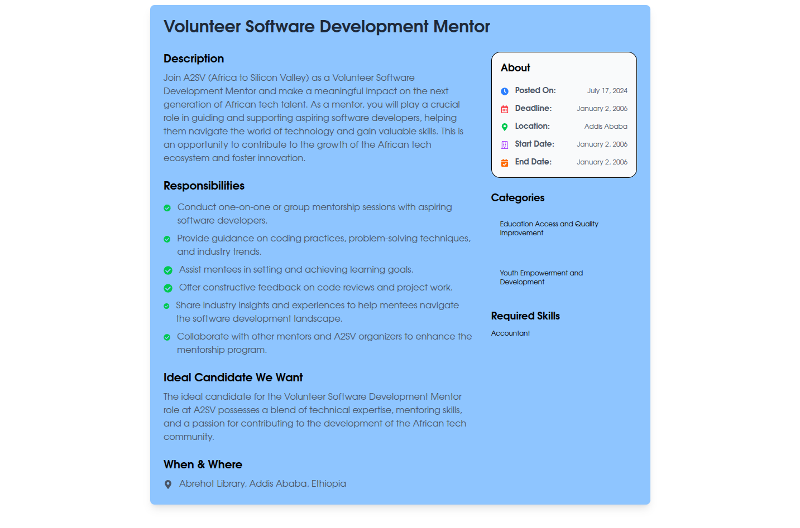

# Job Listing Platform (Redux Version)

A modern job listing platform built with Next.js, TypeScript, and Redux. This project allows users to browse job postings, view detailed job information, and manage application state using Redux for scalable state management.

## Features

- Browse a list of job postings
- View detailed job descriptions, requirements, and company information
- Dynamic routing for job detail pages using job titles as URL slugs
- Global state management with Redux
- Responsive and accessible design
- Built with Next.js App Router and TypeScript
- Uses React Icons for a visually appealing interface

## Project Structure

```
task-7_job-listing-redux/
├── app/
│   ├── globals.css            # Global styles
│   ├── layout.tsx             # Root layout
│   ├── page.tsx               # Main job listing page
│   └── jobs/
│       └── [jobId]/
│           └── page.tsx       # Dynamic job detail page
├── public/                    # Static assets (images, etc.)
├── next.config.ts             # Next.js configuration
├── tsconfig.json              # TypeScript configuration
├── postcss.config.mjs         # PostCSS configuration
└── README.md                  # Project documentation
```

## Getting Started

### Prerequisites

- Node.js (v18 or higher recommended)
- pnpm (or npm/yarn)

### Installation

1. Clone the repository:
   ```bash
   git clone <repo-url>
   cd task-7_job-listing-redux
   ```
2. Install dependencies:
   ```bash
   pnpm install
   # or
   npm install
   # or
   yarn install
   ```
3. Run the development server:
   ```bash
   pnpm dev
   # or
   npm run dev
   # or
   yarn dev
   ```
4. Open [http://localhost:3000](http://localhost:3000) in your browser to view the app.

## Usage

- Browse available jobs on the homepage.
- Click on a job to view its details, requirements, and categories.
- Use the browser's back button or navigation to return to the job list.

## Customization

- To add or edit jobs, modify the job data source file (typically in `app/data.ts` or similar).
- To change job types or requirements, update the types and the data file accordingly.

## Technologies Used

- [Next.js](https://nextjs.org/)
- [TypeScript](https://www.typescriptlang.org/)
- [React](https://react.dev/)
- [Redux](https://redux.js.org/)
- [Tailwind CSS](https://tailwindcss.com/) (if used)
- [React Icons](https://react-icons.github.io/react-icons/)

## Screenshots



