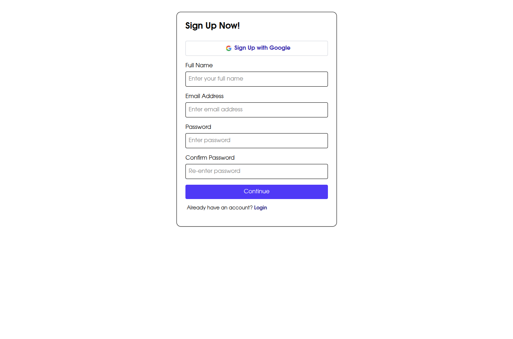
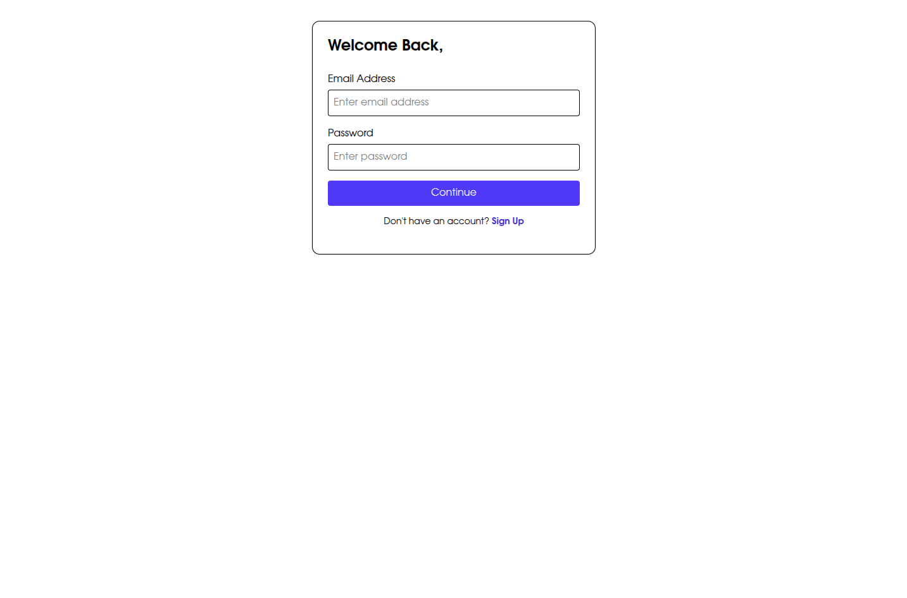
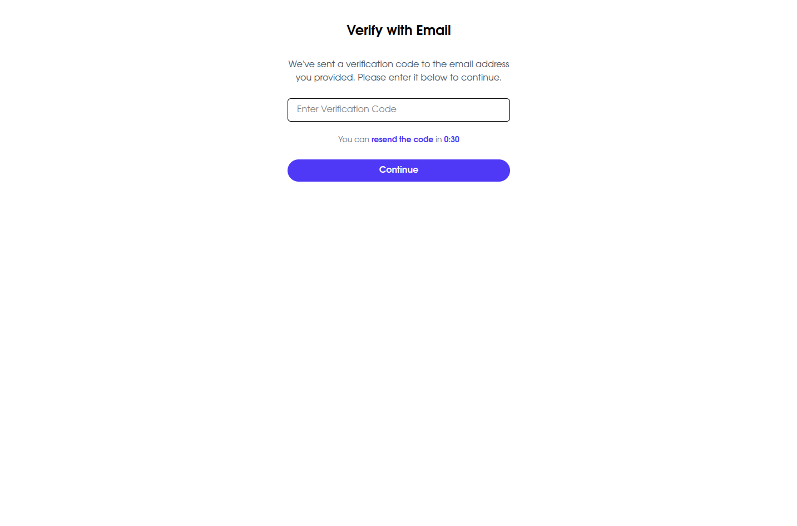

## 🔐 User Authentication App (Task 8)

This project implements a custom user authentication system using Next.js App Router and NextAuth.js. It supports:

- **User Signup**
- **Email Verification**
- **User Login**

---

## 🧱 Tech Stack

- **Next.js 14+** (App Router)
- **NextAuth.js** (Custom Credentials Provider)
- **Tailwind CSS** (UI Styling)

---

## 🚀 Getting Started

1. Clone the repository:
   ```bash git clone https://github.com/nathanaelcheramlak/A2SV-Projects
   cd A2SV-Projects/task-8_job-listing-auth
   ```
2. **Install dependencies**
   ```bash
   npm install
   ```
3. **Setup environment variables**
   Create a `.env.local` file with the following:
   ```env
   GOOGLE_ID=google_id
   GOOGLE_SECRET=google_secret
   NEXTAUTH_SECRET=your_nextauth_secret
   ```
4. **Run the development server**
   ```bash
   npm run dev
   ```
   Open [http://localhost:3000](http://localhost:3000) to view the app.

---

## 📂 Folder Structure

```bash
/app
  /login         # Login page
  /signup        # Signup page
  /verify-email  # Email verification page
  /api
    /auth        # NextAuth API with custom endpoints
/components      # Reusable UI components
```

---

## ✨ Features

- Form validation
- Add session-based protected routes
- Token-based email verification
- API error handling and loading states

---

## Screenshots

## 

## 



## Author

Nathanael @ 2025
